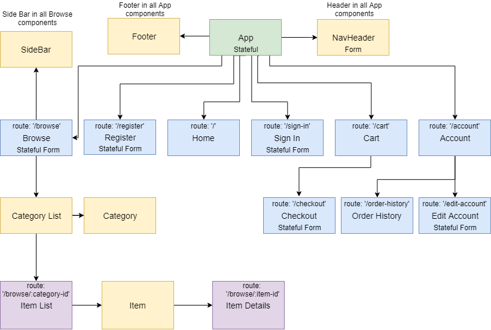

# Online Store Planning
##### A repository for planning capstone project

## Created 09/21/2018

## Made By

  * Nick Rogers  

## Description

A site that holds a static version of the online store concept.

View the static version here: https://github.com/RogersNL/Capstone-Static.git

## Setup

  * Git clone the file  
  * Run npm install  
  * npm start

## Technologies Used

  **ReactJS**

## Support and Contact

For any questions or support details, please email:
  * amellocello@msn.com  

## Notes

## Known Bugs

## Spec

* Outline the basic structure of the project and give a visual representation.
* Create a skeleton for the components in a static program.

**User Stories**
* As a user I want to be able to browse through all the products in the store.
* As a user I want to be able to create an account and sign in.
* As a user I want to be able to select an item and put it into a cart.
* As a user I want to be able to view my past orders.
* As a user I want to be able to edit my account information.
* As a user I want to be able to search for products in the store.
* As a user I want to be able to filter items I'm browsing.

**Component Structure:**

## MIT License

Copyright (c) 2018 **Nick Rogers**

Permission is hereby granted, free of charge, to any person obtaining a copy
of this software and associated documentation files (the "Software"), to deal
in the Software without restriction, including without limitation the rights
to use, copy, modify, merge, publish, distribute, sublicense, and/or sell
copies of the Software, and to permit persons to whom the Software is
furnished to do so, subject to the following conditions:

The above copyright notice and this permission notice shall be included in all
copies or substantial portions of the Software.

THE SOFTWARE IS PROVIDED "AS IS", WITHOUT WARRANTY OF ANY KIND, EXPRESS OR
IMPLIED, INCLUDING BUT NOT LIMITED TO THE WARRANTIES OF MERCHANTABILITY,
FITNESS FOR A PARTICULAR PURPOSE AND NONINFRINGEMENT. IN NO EVENT SHALL THE
AUTHORS OR COPYRIGHT HOLDERS BE LIABLE FOR ANY CLAIM, DAMAGES OR OTHER
LIABILITY, WHETHER IN AN ACTION OF CONTRACT, TORT OR OTHERWISE, ARISING FROM,
OUT OF OR IN CONNECTION WITH THE SOFTWARE OR THE USE OR OTHER DEALINGS IN THE
SOFTWARE.
